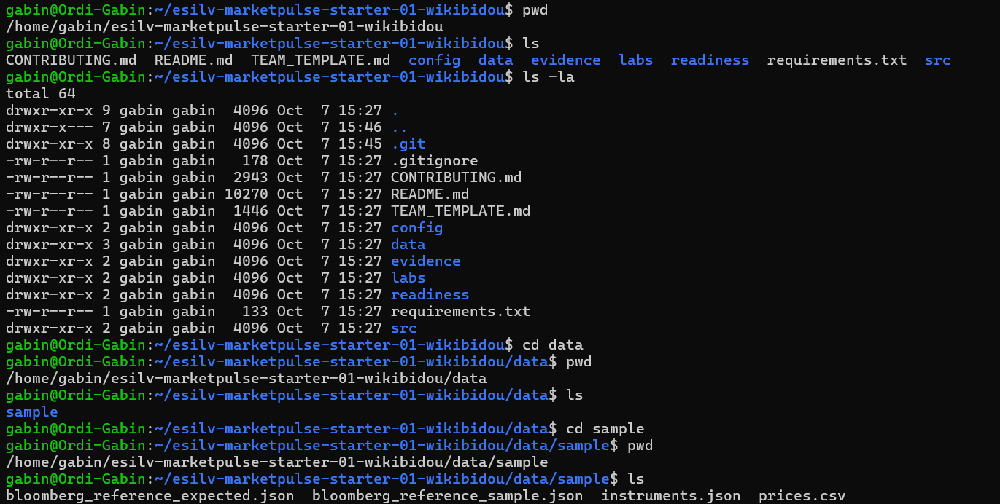
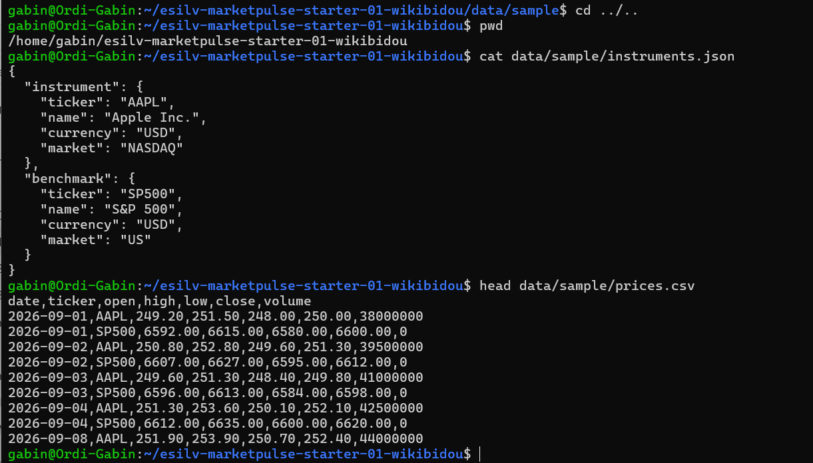
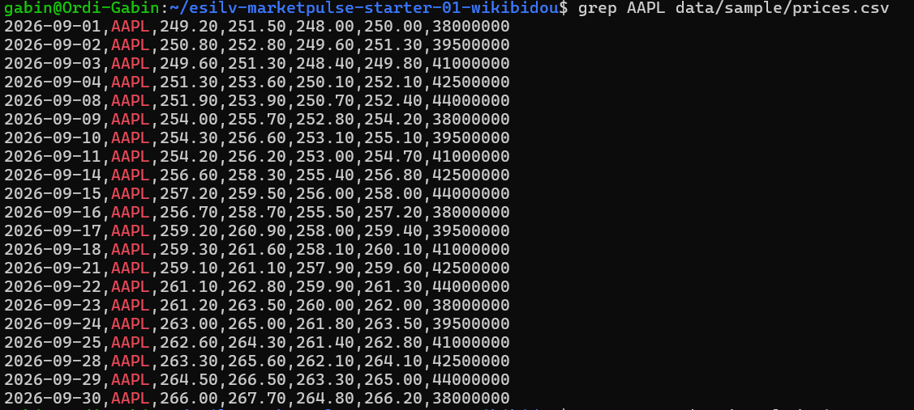
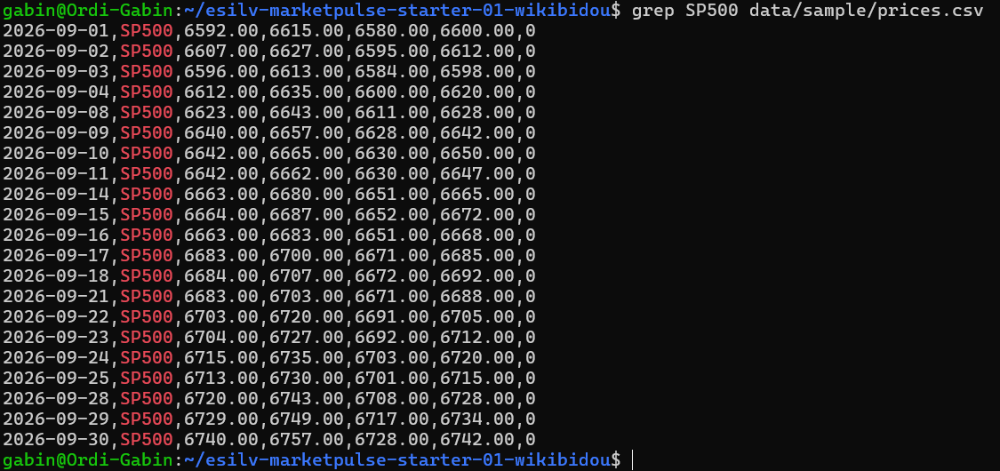
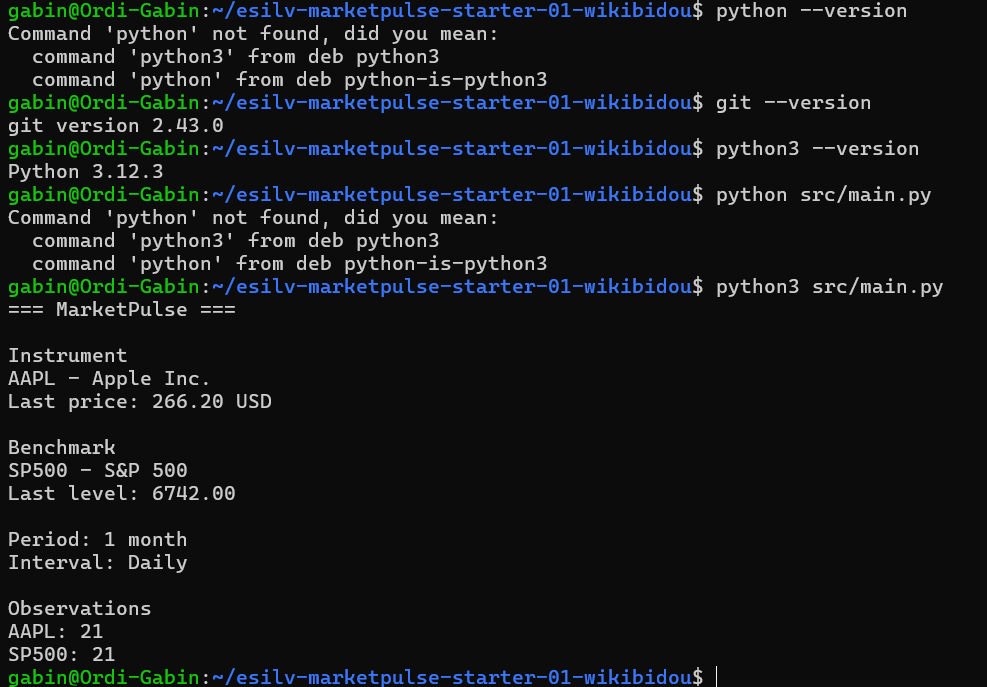
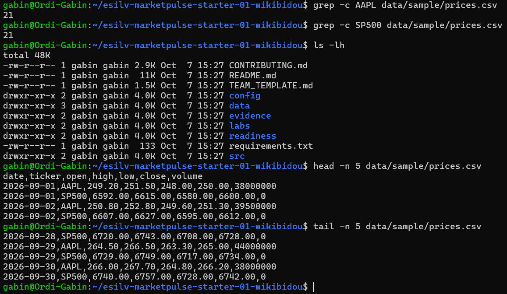
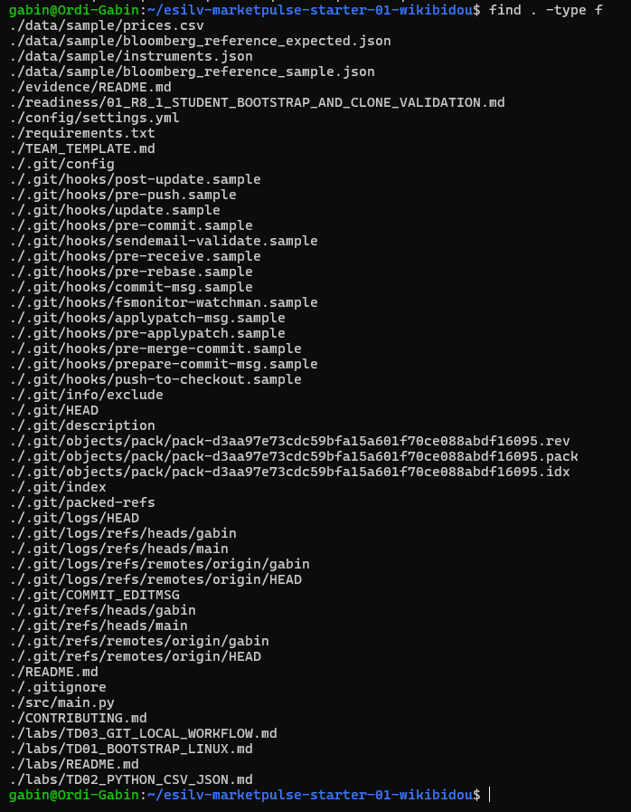
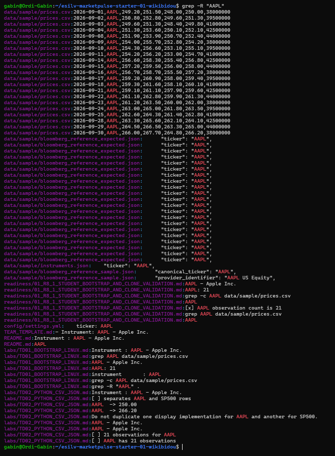
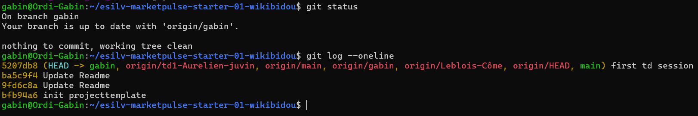

# TD1

## Étape 1
Description de la capture 1.

## Étape 2
Description de la capture 2.

## Étape 3
Description de la capture 3.

## Étape 4
Description de la capture 4.

## Étape 5
Description de la capture 5.

## Étape 6
Description de la capture 6.

## Étape 7
Description de la capture 7.

## Étape 8
Description de la capture 8.

## Étape 9
Description de la capture 9.

