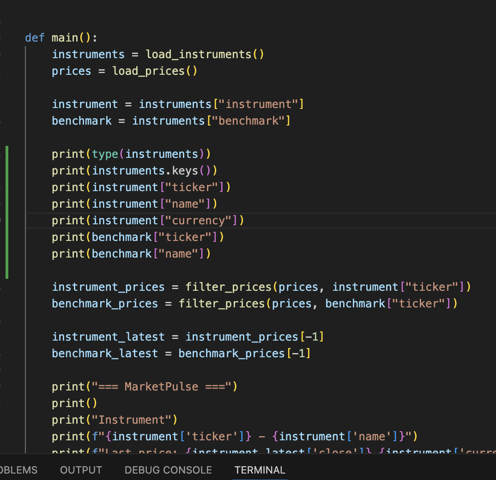
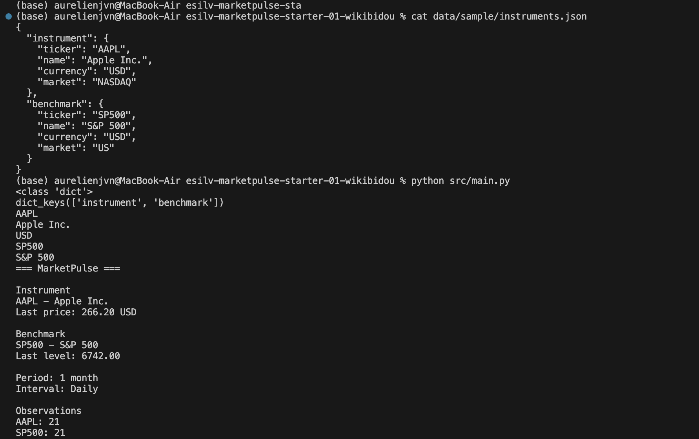
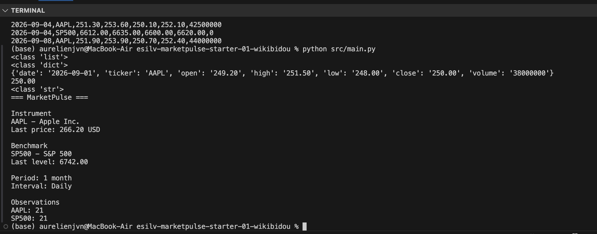
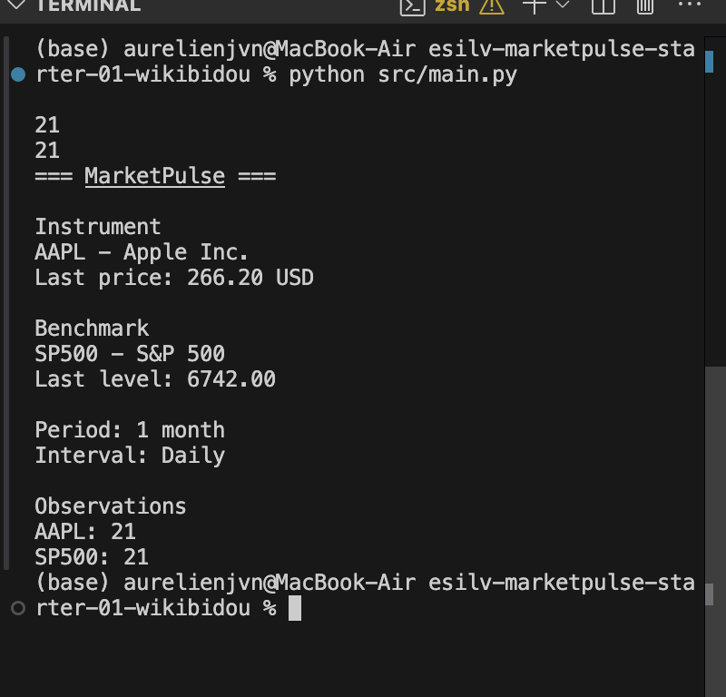
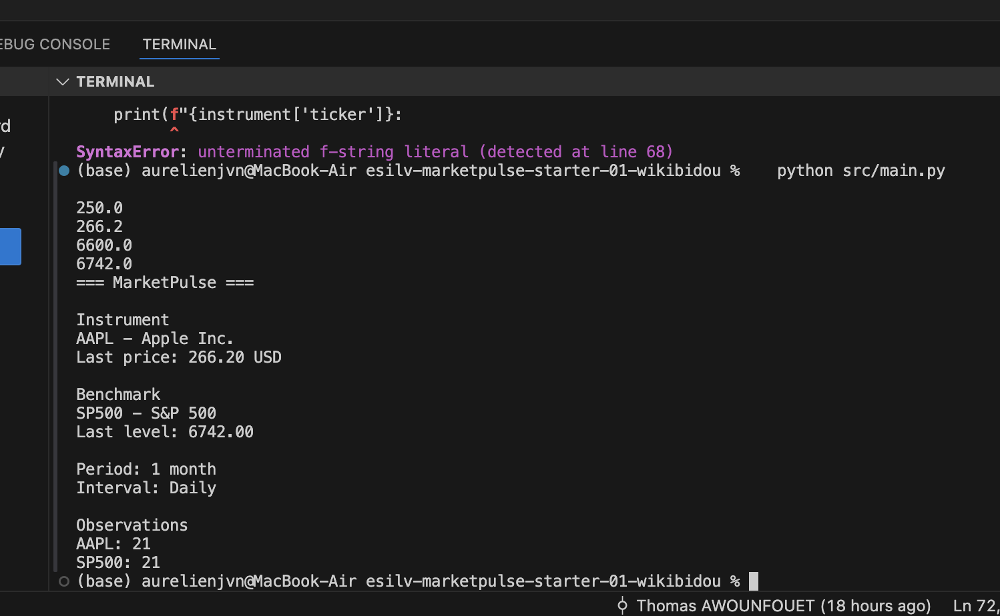
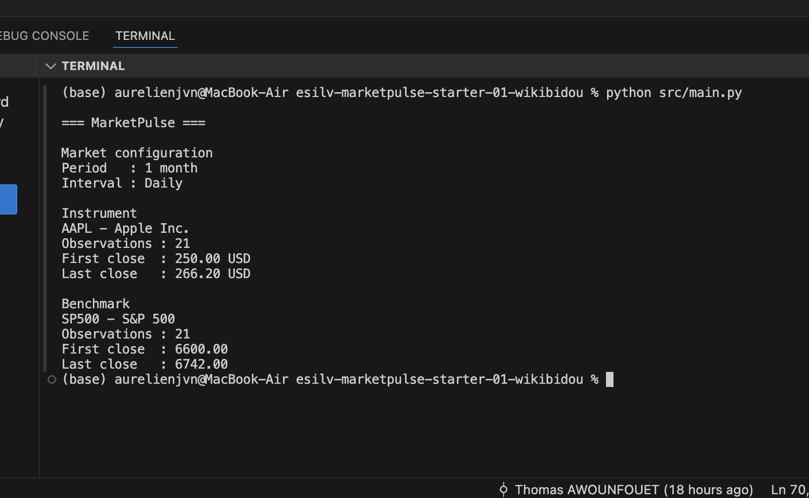
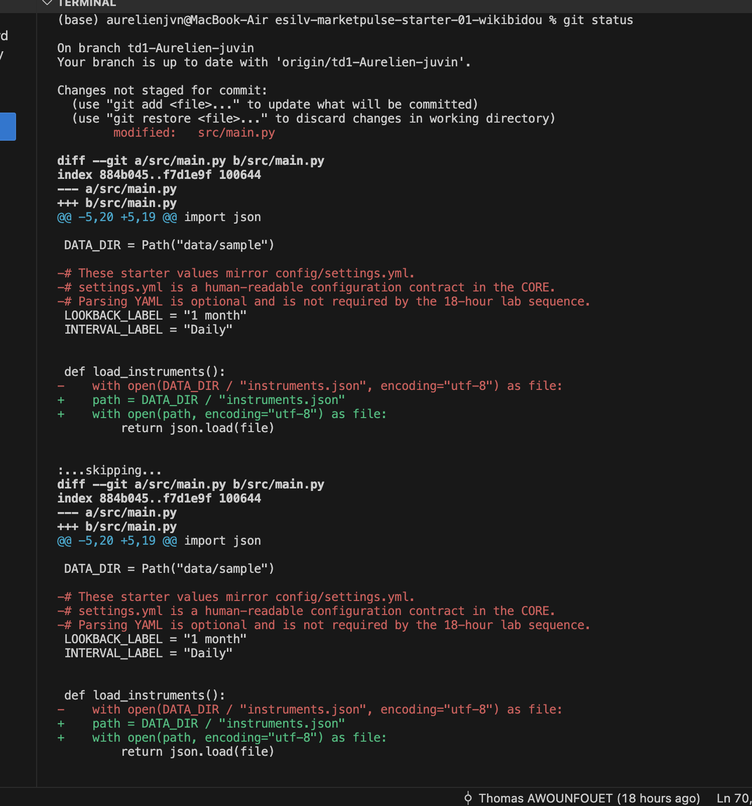

# TD02 - Python + CSV / JSON
**Auteur :** Aurélien Juvin

## Partie 2 - JSON et dictionnaires

## Partie 3 - CSV et liste de dictionnaires

## Partie 4 - Filtrage AAPL / SP500

## Partie 5 - Premier et dernier close

## Parties 6 à 8 - Résumé réutilisable et validation finale

## Partie 10 - Modifications prêtes pour le TD03

